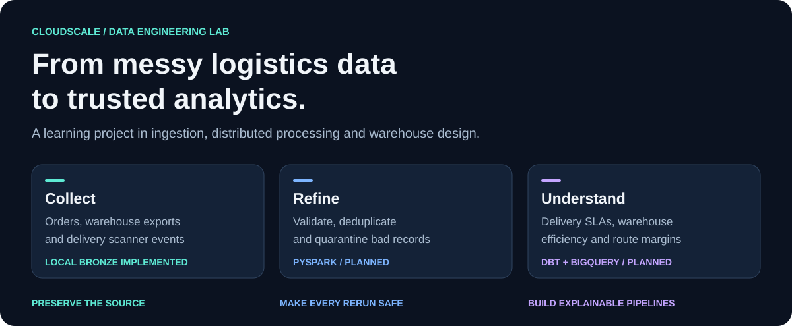
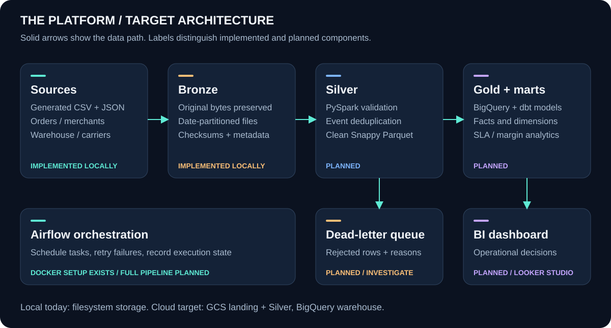
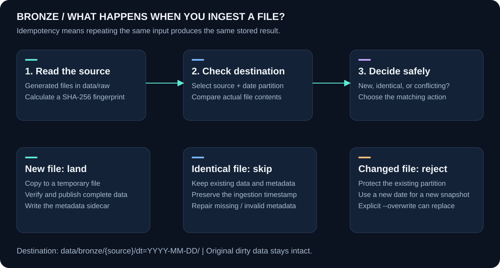
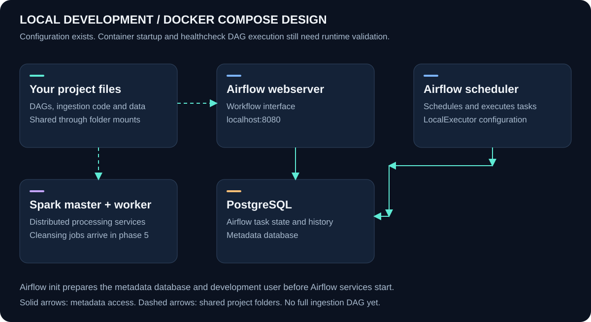

<p align="center">
  
</p>

<h1 align="center">CloudScale</h1>
<p align="center"><strong>Cloud data migration and logistics analytics — built step by step.</strong></p>

<p align="center">
  
  
  
  
</p>

<p align="center">
  <a href="#architecture">Architecture</a> · <a href="#project-status">Status</a> · <a href="#quick-start">Quick start</a> · <a href="#learning-roadmap">Roadmap</a> · <a href="#documentation">Documentation</a>
</p>

## Why CloudScale exists

A logistics company needs to answer simple questions: **Which parcels arrived late? Where do warehouse delays happen? Which routes make money?** Its data makes those questions difficult: orders come from a database, warehouses send CSVs, and courier scanners resend delivery events over unreliable networks.

CloudScale is a hands-on data engineering project that brings these inputs into a shared platform. Its design moves from original files to clean datasets, a dimensional warehouse, and business metrics. Each phase introduces an engineering problem and a way to verify the solution.

| Source | Typical problem | Intended treatment |
| --- | --- | --- |
| Orders and merchants | Missing IDs, invalid values, future dates | Preserve originals; validate downstream |
| Warehouse CSVs | Invalid weights and reversed timestamps | Quarantine rejected rows with error reasons |
| Carrier JSON events | Duplicate scans and delayed messages | Deduplicate and handle late arrivals |

## Project status

**The local generator and Bronze ingestion are implemented and tested.** Planned components are labeled in the diagrams.

| Component | Current state |
| --- | --- |
| Architecture and source contracts | Documented |
| Synthetic dirty data generator | Implemented |
| Docker stack: Airflow, PostgreSQL, Spark | Configured; container startup and DAG execution unverified |
| Local Bronze ingestion | Implemented and tested |
| PySpark validation, deduplication, and Silver | Planned — phase 5 |
| BigQuery, dbt, full orchestration, CI, dashboards | Planned — phases 6–12 |

Extractors currently read **generated local files**. Live PostgreSQL, FTP, webhook endpoints, and GCS uploads are future integrations. Checks run locally; automated CI is planned.

## Architecture



The **medallion architecture** gives each data layer a specific purpose:

| Layer | Purpose | Tooling | Example |
| --- | --- | --- | --- |
| **Bronze** | Preserve original input for replay | Local files today; GCS planned | Warehouse CSV with its invalid weights intact |
| **Silver** | Validate, standardize, deduplicate | PySpark + Parquet, planned | Events with valid IDs and timestamps |
| **Gold** | Connect business entities | BigQuery + dbt, planned | Shipment facts linked to carrier dimensions |
| **Analytics marts** | Produce focused business measures | dbt + BI, planned | Daily carrier performance and route margins |

A **dead-letter queue (DLQ)** stores rejected rows and their error reasons for investigation. Airflow will coordinate the full pipeline and retry failures. The current DAG is a small infrastructure healthcheck.

## How Bronze ingestion works



**Collect original data safely before cleaning it.** Dirty values and duplicate events stay in Bronze for phase 5 to process.

- **Partitions:** `dt=2026-10-01` groups files for a batch date.
- **Idempotency:** identical reruns preserve existing files and metadata.
- **Conflict protection:** changed input in an existing partition raises an error. Use a new partition for a new snapshot; `--overwrite` allows deliberate replacement.
- **Staged writes:** complete copies are verified before publication. A failed copy leaves existing data intact.
- **Metadata:** each file has a `.meta.json` sidecar recording its source, ingestion time, record count, and checksum — a fingerprint of its contents. Missing or invalid sidecars can be repaired on retry.

```text
data/
├── raw/                                  # Generated source files
│   ├── postgres_orders/dt=2026-10-01/
│   ├── postgres_merchants/merchants.csv
│   ├── wms_picks/dt=2026-10-01/
│   └── carrier_events/dt=2026-10-01/
└── bronze/                               # Collected originals + metadata
    ├── postgres_orders/dt=2026-10-01/
    ├── postgres_merchants/dt=2026-10-01/  # Daily merchant snapshot
    ├── wms_picks/dt=2026-10-01/
    └── carrier_events/dt=2026-10-01/
```

## Quick start

Use **Python 3.10+** from the repository root. This demo needs Faker and pytest; Docker and cloud credentials are not required. The destination filesystem must support hard links, as NTFS and ext4 do.

**1. Prepare your environment.**

```powershell
python -m venv .venv
# Windows PowerShell:
.\.venv\Scripts\Activate.ps1
# macOS / Linux, instead:
# source .venv/bin/activate
python -m pip install faker pytest
```

The full `requirements.txt` also includes dependencies for later phases. The smaller installation above is enough for this demo.

**2. Generate a batch and land all sources.**

```powershell
python -m data_generator.generate_legacy_data --count 1000 --date 2026-10-01
python -m ingestion.extract_postgres --date 2026-10-01
python -m ingestion.extract_wms_csv --date 2026-10-01
python -m ingestion.extract_carrier_webhooks --date 2026-10-01
```

Source files stay in `data/raw`; collected copies go to `data/bronze`. The PostgreSQL extractor handles both orders and merchants. Each extractor prints a JSON summary of landed and skipped files. Tune the seed and anomaly rates in [anomaly_rates.json](data_generator/configs/anomaly_rates.json).

**3. Check safe reruns and run the tests.**

Repeat the three extraction commands. Identical files should report `skipped`, keeping existing data and metadata intact.

```powershell
python -m pytest tests -q
```

At the phase 4 checkpoint, **14 tests pass**, covering generation, ingestion, and DAG Python syntax. The syntax check does not prove that Airflow services run successfully.

## Local development design



Airflow's PostgreSQL database stores workflow state and history. It is separate from the legacy business database represented by generated orders.

Start Docker Desktop or Docker Engine before trying the containerized setup:

```powershell
docker compose config --quiet
docker compose up -d --build
docker compose ps
```

The configured Airflow UI is at [localhost:8080](http://localhost:8080), with local development credentials `admin` / `admin`. Inspect service health and trigger `healthcheck_dag` once the stack is running.

**Validation boundary:** Compose configuration validation has passed. Image builds, container startup, and healthcheck DAG execution remain unverified. Configuration validity alone does not guarantee a running stack.

## Learning roadmap

| Phase | Focus | Progress |
| --- | --- | --- |
| 1 | Architecture, business domain, contracts | Documented |
| 2 | Synthetic dirty data generation | Implemented |
| 3 | Local Docker development stack | Configured; runtime check pending |
| 4 | Bronze storage and ingestion | Implemented and tested locally |
| **5 — next** | **PySpark cleansing and Silver datasets** | **Planned** |
| 6 | BigQuery datasets and staging | Planned |
| 7 | dbt dimensional models and marts | Planned |
| 8 | Full Airflow orchestration | Planned |
| 9 | Data quality and failure alerts | Planned |
| 10 | GitHub Actions CI/CD | Planned |
| 11 | Cost controls and security hardening | Planned |
| 12 | Analytics delivery and project presentation | Planned |

The cloud design aims to minimize cost through small datasets, partitioned storage, and query limits. Cloud services are not provisioned by this demo; a zero-cost deployment has not been verified.

## Repository map

```text
CloudScale/
├── airflow/
│   ├── dags/healthcheck_dag.py       # Infrastructure verification workflow
│   └── plugins/alert_handlers.py    # Alert callback code
├── data_generator/                  # Synthetic sources and anomaly configuration
├── ingestion/                       # Local Bronze landing and extractors
├── docker/                          # Airflow and Spark image definitions
├── docs/
│   ├── assets/                      # README diagrams + regeneration script
│   ├── ARCHITECTURE_AND_ROADMAP.md
│   ├── data_dictionary.md
│   └── PHASE_3_4_REPORT.md
├── tests/
│   ├── unit/                        # Generator and ingestion tests
│   └── integration/                 # DAG syntax validation
├── .env.example                     # Example local configuration
├── docker-compose.yml               # Local service topology
├── Makefile                         # Developer shortcuts
└── requirements.txt                 # Full project dependencies
```

`spark/` jobs, the `dbt/` project, and `.github/workflows/` are planned additions. Generated data and credentials are excluded from version control.

## Documentation

| Read this | To understand |
| --- | --- |
| [Architecture and roadmap](docs/ARCHITECTURE_AND_ROADMAP.md) | Target platform, business context, and phase-by-phase learning plan |
| [Data dictionary](docs/data_dictionary.md) | Source fields, validation rules, and intended warehouse relationships |
| [Phase 3 and 4 report](docs/PHASE_3_4_REPORT.md) | What was implemented, tested, and what remains |
| [Visual sources](docs/assets/generate_visuals.py) | Regenerate all four SVGs with `python docs/assets/generate_visuals.py` |

The architecture documents describe the target system. The status table above describes the current implementation.
