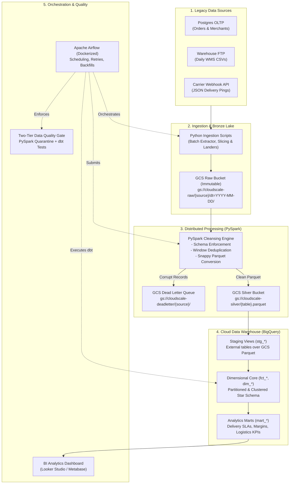
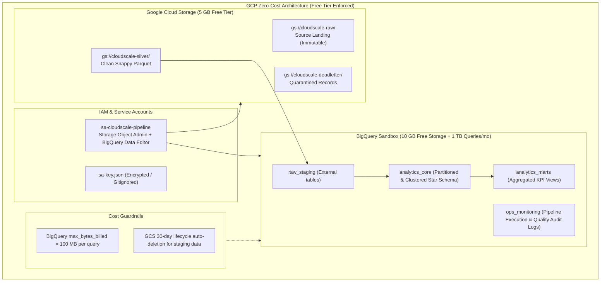
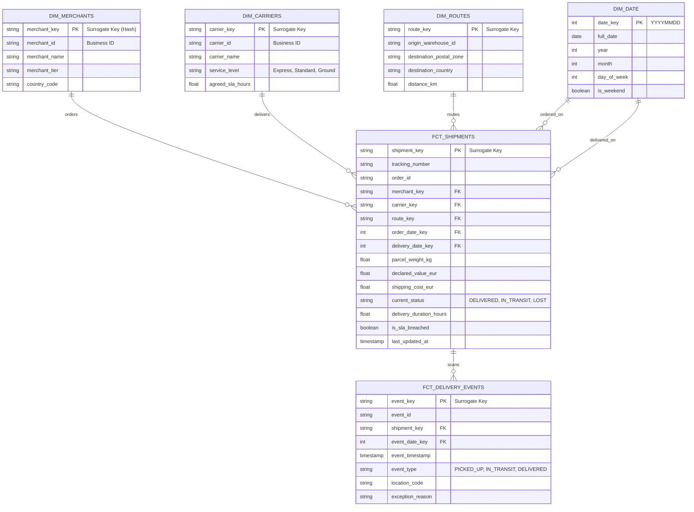
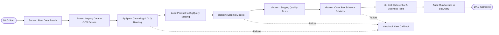

# CloudScale — Cloud Data Migration & Analytics Platform
## Master Technical Architecture & Implementation Blueprint

**Mentor:** Senior Data Engineer  
**Student:** 3rd-Year Data Science & Engineering Student  
**Target Roles:** Data Engineer Intern, Cloud Data Engineer Intern, Data Platform Intern, PFE Internship  
**Project Repository:** `cloudscale/`

---

## Table of Contents
1. [Business Domain & Legacy Migration Context](#1-business-domain--legacy-migration-context)
2. [End-to-End Lakehouse Architecture & Medallion Layers](#2-end-to-end-lakehouse-architecture--medallion-layers)
3. [The 5 Real-World Data Engineering Challenges](#3-the-5-real-world-data-engineering-challenges)
4. [GCP Cloud Architecture & Zero-Cost Strategy](#4-gcp-cloud-architecture--zero-cost-strategy)
5. [PySpark Distributed Processing Blueprint](#5-pyspark-distributed-processing-blueprint)
6. [dbt Warehouse Modeling & Dimensional Design](#6-dbt-warehouse-modeling--dimensional-design)
7. [Apache Airflow Orchestration Blueprint](#7-apache-airflow-orchestration-blueprint)
8. [Two-Tier Data Quality & Auditing Architecture](#8-two-tier-data-quality--auditing-architecture)
9. [CI/CD & Containerized Development Stack](#9-cicd--containerized-development-stack)
10. [Repository Directory Structure](#10-repository-directory-structure)
11. [Project Scope Levels (MVP vs. Strong CV vs. Advanced)](#11-project-scope-levels-mvp-vs-strong-cv-vs-advanced)
12. [Detailed 12-Phase Implementation Roadmap](#12-detailed-12-phase-implementation-roadmap)
13. [Learning-First Syllabus: Pre-Requisites for Each Tool](#13-learning-first-syllabus-pre-requisites-for-each-tool)
14. [Technical Interview Defense Guide](#14-technical-interview-defense-guide)
15. [CV Positioning & High-Impact Resume Bullets](#15-cv-positioning--high-impact-resume-bullets)
16. [Final Success Verification Checklist](#16-final-success-verification-checklist)

---

## 1. Business Domain & Legacy Migration Context

### 1.1 The Company: "LogiScale Express"
**LogiScale Express** is a cross-border logistics and fulfillment marketplace connecting:
- **Merchants:** E-commerce businesses storing catalog items in LogiScale fulfillment hubs.
- **Fulfillment Centers (WMS):** Facilities handling receiving, pick, pack, and dispatch.
- **Last-Mile Carriers:** Couriers (DHL, FedEx, regional fleets) executing delivery to end customers.

### 1.2 Legacy Pain Points & Migration Drivers
1. **OLTP Database Contention:** Reporting queries locked tables on the transactional PostgreSQL database during peak operational hours.
2. **Archaic WMS Batch Drops:** Daily CSV exports from warehouse systems had silent schema drifts, unquoted delimiters, and missing foreign keys.
3. **Carrier Webhook Duplication:** Mobile courier scanners re-transmitted delivery scans 3 to 5 times due to unstable cellular connections.
4. **SLA Breach Penalties:** Late parcels incurred contractual penalty fees. Because tracking pings were delayed and dropped, management could not proactively identify bottlenecks.
5. **Currency Confusion:** Shipping fees and refunds were recorded across EUR, USD, and GBP without point-in-time exchange rates.

### 1.3 Core Business Questions the Warehouse Answers
- **On-Time In-Full (OTIF) Rate:** % of shipments delivered within promised SLA hours by carrier, service tier, and destination country.
- **Fulfillment Dispatch Lag:** Median duration between `ORDER_PLACED`, `PICKED`, and `DISPATCHED` across warehouses.
- **Carrier Exception Attribution:** Postal zones with highest rates of `FAILED_DELIVERY_ATTEMPT`, `DAMAGED`, or `LOST` packages.
- **Route Profitability:** Net shipping margin per parcel after carrier fees, customs clearance, and return costs.

---

## 2. End-to-End Lakehouse Architecture & Medallion Layers



### 2.1 Layer Responsibilities & ETL vs. ELT Strategy
- **Bronze Layer (`gs://cloudscale-raw/`):** Immutable, append-only landing of source data in native formats (JSON, CSV, SQL dumps). Partitioned by `dt=YYYY-MM-DD`. Never modified.
- **Silver Layer (`gs://cloudscale-silver/` & `raw_staging`):** Standardized, columnar Snappy Parquet. PySpark handles explicit typing, strips whitespace, removes network duplicate pings, and routes corrupt rows to DLQ.
- **Gold Layer (`analytics_core`):** Star Schema (Facts and Dimensions) in BigQuery modeled with **dbt Core**. Uses surrogate keys, incremental merges, and referential integrity testing.
- **Platinum Layer (`analytics_marts`):** Pre-aggregated, denormalized data marts optimized for dashboard queries and business reporting.
- **Architectural Rationale (ETL vs. ELT):** Heavy file-level parsing, binary checks, and DLQ quarantine happen *before* the warehouse in PySpark (Extract & Load). Business modeling, surrogate key hashing, and metric rollups happen *inside* BigQuery using dbt SQL pushdown (Transform).

---

## 3. The 5 Real-World Data Engineering Challenges

| Challenge | Problem Injected | Architectural Solution |
| :--- | :--- | :--- |
| **1. Data Quality & Corruption** | Missing merchant IDs, negative weights, future timestamps, unparseable date strings (`2026/02/30`). | **Dead Letter Queue (DLQ) pattern**: PySpark isolates corrupt records into `gs://cloudscale-deadletter/` with error codes; clean data continues downstream. |
| **2. Schema Evolution** | Carrier API introduces Version 2 payload: `{ "tracking_code": "TRK-123", "customs_fee": 14.50, "currency": "EUR" }` replacing Version 1 `{ "order_id": 123 }`. | PySpark schema unification with safe type casting and `coalesce()` fallbacks to prevent pipeline failure. |
| **3. Duplicate Webhooks & Idempotency** | Couriers re-send identical delivery scans 3 to 5 times over spotty networks. Task reruns must not create duplicate records. | PySpark window deduplication (`ROW_NUMBER() OVER PARTITION BY event_id ORDER BY scan_timestamp DESC`) + dbt `incremental` models using `unique_key`. |
| **4. Late-Arriving Data** | Mountain route delivery events scanned on Monday only sync to the cloud on Thursday. | Decoupled **Event Time** (`scanned_at`) from **Ingestion Time** (`ingested_at`). dbt incremental models with a 3-day lookback window reconcile late events. |
| **5. Pipeline Failure & Recovery** | Simulated network failure or malformed payload in the middle of a multi-table ETL run. | Airflow task retries with exponential backoff, atomic staging writes, and stateful failure alerting via webhooks. |

---

## 4. GCP Cloud Architecture & Zero-Cost Strategy



### Cost Prevention Rules
1. **GCS:** Free tier includes 5 GB storage. 100,000 Parquet records require ~25 MB. Cost: **$0.00**.
2. **BigQuery:** Free sandbox tier provides 10 GB active storage and 1 TB query scans per month. Cost: **$0.00**.
3. **Scan Limits:** All queries enforce `maximum_bytes_billed = 104857600` (100 MB). Runaway full-table scans fail automatically before consuming quota.
4. **Local Fallback:** Dockerized PySpark + MinIO/local filesystem allows 100% offline development before touching GCP.

## 5. PySpark Distributed Processing Blueprint

### 6.1 PySpark Responsibilities
1. **Explicit Schema Enforcement:** Replaces fragile `inferSchema=True` with explicit `StructType` schemas.
2. **Dead Letter Queue Routing:** Corrupted records (negative weights, invalid dates, unparseable IDs) are isolated with error metadata:
   ```python
   df_with_status = df.withColumn(
       "_error_code",
       when(col("parcel_weight_kg") <= 0, "ERR_INVALID_WEIGHT")
       .when(col("order_date") > current_timestamp(), "ERR_FUTURE_DATE")
       .otherwise(None)
   )
   df_clean = df_with_status.filter(col("_error_code").isNull()).drop("_error_code")
   df_corrupt = df_with_status.filter(col("_error_code").isNotNull())
   ```
3. **Window Deduplication:** Filters duplicate webhook delivery scans:
   ```python
   window_spec = Window.partitionBy("event_id").orderBy(col("scan_timestamp").desc())
   df_deduped = df.withColumn("rn", row_number().over(window_spec)).filter(col("rn") == 1).drop("rn")
   ```
4. **Snappy Parquet Export:** Partitions output by `year=YYYY/month=MM/` for BigQuery ingestion efficiency.

### 6.2 Scaling to 1 TB/Day (Interview Talking Point)
- Transition from local containers to **Dataproc Serverless Spark**.
- Tune partition sizes to 128 MB blocks to avoid executor memory starvation.
- Replace full shuffles with broadcast joins for small dimension lookups (`broadcast(dim_df)`).

---

## 6. dbt Warehouse Modeling & Dimensional Design

### 7.1 Star Schema ERD



### 7.2 Incremental Merge Model with Late Data Lookback
In `dbt/models/marts/core/fct_shipments.sql`:
```sql
{{
  config(
    materialized = 'incremental',
    unique_key = 'shipment_key',
    partition_by = {
      "field": "order_date",
      "data_type": "date",
      "granularity": "day"
    },
    cluster_by = ["carrier_id", "current_status"]
  )
}}

with source_data as (
    select * from {{ ref('int_shipments_joined') }}
    
    -- 3-day lookback window reconciles late-arriving mobile scans
    where last_updated_at >= date_sub(_current_date, interval 3 day)
    
)

select * from source_data
```

---

## 7. Apache Airflow Orchestration Blueprint



### Airflow Production Safeguards
- **Deterministic Context (`logical_date`):** Running historical backfills processes only the execution period's interval (`data_interval_start` to `data_interval_end`).
- **Retries with Exponential Backoff:** Tasks retry up to 3 times (`retries=3, retry_delay=timedelta(minutes=5), retry_exponential_backoff=True`) to absorb temporary network dips.
- **Stateful Alerting:** `on_failure_callback` sends error context, task ID, and execution date to Discord/Slack webhooks.

---

## 8. Two-Tier Data Quality & Auditing Architecture

### 9.1 The Quality Defense in Depth
1. **Tier 1 (PySpark Ingestion Gate):** Validates physical structure, data types, and critical non-null constraints. Violations route to GCS DLQ without aborting the batch.
2. **Tier 2 (dbt Warehouse Gate):** Validates relational and business integrity inside BigQuery:
   - Primary key uniqueness & non-null constraints (`unique`, `not_null`).
   - Referential integrity (`relationships` between `fct_shipments` and `dim_carriers`).
   - Custom business logic assertions (e.g., `delivery_date >= order_date`, `shipping_cost >= 0`).

### 9.2 BigQuery Audit Schema (`ops_monitoring`)
- **`pipeline_execution_audit`:** Records `run_id`, `dag_id`, `task_id`, `records_extracted`, `records_loaded_clean`, `records_quarantined_dlq`, and `duration_seconds`.
- **`data_quality_test_audit`:** Logs test names, target models, number of failing rows, and execution timestamps.

---

## 9. CI/CD & Containerized Development Stack

### 10.1 GitHub Actions Workflow (`ci.yml`)
Runs on every pull request to `main`:
1. **Linting:** `black --check .`, `flake8 .`, and `sqlfluff lint dbt/models/ --dialect bigquery`.
2. **Unit Tests:** `pytest tests/unit/` testing PySpark transformation functions with small mock DataFrames.
3. **dbt Validation:** `dbt compile --profiles-dir dbt/` ensuring SQL syntax, Jinja macros, and refs compile without errors.
4. **Docker Validation:** `docker compose config` verifies configuration integrity.

### 10.2 Local Docker Development Stack
```
docker-compose.yml services:
├── postgres-airflow        # Metadata database for Airflow
├── airflow-webserver       # Airflow UI (localhost:8080)
├── airflow-scheduler       # DAG task executor
├── spark-runner            # PySpark local container with JVM & Python dependencies
└── data-generator          # Synthetic legacy data producer
```

---

## 10. Repository Directory Structure

```
cloudscale/
├── .github/workflows/
│   ├── ci.yml                     # PR validation (lint, pytest, dbt compile)
│   └── cd.yml                     # Main deployment triggers
├── airflow/
│   ├── dags/cloudscale_dag.py     # Master orchestration DAG
│   └── plugins/alert_handlers.py  # Webhook alerting handlers
├── data_generator/
│   ├── generate_legacy_data.py    # Synthetic dirty data producer
│   └── configs/anomaly_rates.json # Tunable corrupt data injection rates
├── ingestion/
│   ├── extract_postgres.py        # Relational database extractor
│   ├── extract_wms_csv.py         # FTP batch CSV extractor
│   └── extract_carrier_webhooks.py# JSON webhook sink
├── spark/
│   ├── jobs/process_shipments.py  # Cleansing, schema evolution, and DLQ routing
│   └── utils/spark_builder.py     # SparkSession configuration (local vs GCP)
├── dbt/
│   ├── dbt_project.yml            # dbt project configuration
│   ├── profiles.yml               # BigQuery & local DuckDB connection profiles
│   ├── models/
│   │   ├── staging/               # 1:1 view cleaning (stg_*)
│   │   ├── intermediate/          # Joins & surrogate keys (int_*)
│   │   └── marts/                 # Star schema (fct_*, dim_*, mart_*)
│   └── tests/                     # Singular custom business assertion tests
├── docker/
│   ├── Dockerfile.airflow         # Custom Airflow image with dbt & Spark
│   └── Dockerfile.spark           # Standalone PySpark worker image
├── docs/
│   ├── ARCHITECTURE_AND_ROADMAP.md# This master blueprint
│   ├── data_dictionary.md         # Schema and business definitions
│   └── interview_defense.md       # Technical interview prep
├── dashboards/queries/            # Dashboard SQL queries
├── tests/
│   ├── unit/test_spark_jobs.py    # PySpark unit tests with mock DataFrames
│   └── integration/test_dag.py    # Airflow DAG integrity tests
├── docker-compose.yml             # Local dev stack definition
├── Makefile                       # Developer shortcuts (make test, make run)
└── README.md                      # Recruiter-facing portfolio presentation
```

---

## 11. Project Scope Levels

```
┌─────────────────────────────────────────────────────────────────────────────┐
│ 1. MVP (Minimum Viable Portfolio) — Target: 2–3 Weeks                       │
│ - Generate synthetic dirty CSV & JSON data to local / GCS Raw               │
│ - PySpark job cleanses, deduplicates, and outputs Parquet + DLQ             │
│ - BigQuery staging tables loaded from clean Parquet                         │
│ - dbt models build Star Schema (Facts + Dimensions)                         │
│ - Airflow DAG orchestrates end-to-end execution in Docker Compose           │
├─────────────────────────────────────────────────────────────────────────────┤
│ 2. Strong CV Version (Recommended) — Target: 4–5 Weeks                      │
│ - All of MVP, plus:                                                         │
│ - Full cloud deployment to GCP (GCS + BigQuery Free Tier)                   │
│ - Two-tier Data Quality (DLQ in GCS + dbt tests in BigQuery)                │
│ - Incremental dbt models with late-arriving data lookback                   │
│ - GitHub Actions CI/CD with PyTest and SQLFluff                             │
│ - Operational audit logging table in BigQuery                               │
│ - BI Dashboard in Looker Studio / Metabase displaying logistics KPIs        │
├─────────────────────────────────────────────────────────────────────────────┤
│ 3. Advanced Version (Optional Extensions) — Target: 6+ Weeks                │
│ - All of Strong CV, plus:                                                   │
│ - Infrastructure as Code with Terraform (provision GCS & BigQuery)          │
│ - Real-time webhook ingestion via Cloud Functions / Cloud Run                │
│ - Slack / Discord webhook alerting on pipeline failure                       │
│ - dbt documentation hosted via GitHub Pages                                  │
└─────────────────────────────────────────────────────────────────────────────┘
```

---

## 12. Detailed 12-Phase Implementation Roadmap

### Phase 1: Architecture, Business Domain & Contracts
- **Objective:** Establish formal business contracts, schema definitions, and target DDLs before writing code.
- **Concepts to Learn:** Kimball dimensional modeling, Star Schema vs. 3NF, surrogate keys vs. natural keys.
- **Tasks:** Document source schemas, column types, and create `docs/data_dictionary.md`.
- **Deliverables:** `docs/data_dictionary.md` and dimensional model ERD.
- **Validation Criteria:** Every business question from Section 1.3 can be answered via a simple SQL query on the proposed schema.
- **Mental Checkpoint:** *Can you defend why facts are numeric/additive while dimensions are descriptive attributes?*

### Phase 2: Synthetic Dirty Data Generator
- **Objective:** Build a realistic synthetic data generator that injects deliberate enterprise anomalies.
- **Concepts to Learn:** Reproducible seeding, Faker library, realistic anomaly injection (corrupted timestamps, null foreign keys, negative weights, network duplicates).
- **Tasks:** Build `data_generator/generate_legacy_data.py` producing 100,000+ records across Orders (Postgres SQL/CSV), WMS Picks (CSV), and Carrier Webhooks (JSON).
- **Deliverables:** Working generator generating dirty multi-source datasets.
- **Validation Criteria:** Ingestion data contains predictable 2–5% error rates matching test parameters.
- **Mental Checkpoint:** *If an interviewer asks where the data came from, can you explain how your synthetic generator simulates real-world edge cases?*

### Phase 3: Local Docker Development Stack
- **Objective:** Configure a single-command local development environment.
- **Concepts to Learn:** Docker multi-container networking, volume bind mounts, container healthchecks, environment variable security.
- **Tasks:** Assemble `docker-compose.yml` with Airflow (webserver, scheduler, postgres metadata DB) and PySpark runner.
- **Deliverables:** Working `docker-compose.yml` tested via `docker compose up`.
- **Validation Criteria:** Airflow Web UI accessible at `localhost:8080`, scheduler executes dummy DAG cleanly.
- **Mental Checkpoint:** *How does the Airflow scheduler communicate task state to the webserver via PostgreSQL?*

### Phase 4: Bronze Storage & Ingestion Layer
- **Objective:** Ingest legacy files and land them immutably into partitioned Bronze storage.
- **Concepts to Learn:** Data lake partitioning strategies (`dt=YYYY-MM-DD`), object immutability, idempotent uploads.
- **Tasks:** Build ingestion scripts in `ingestion/` uploading raw files to GCS or local directory emulator.
- **Deliverables:** Partitioned raw landing structure with metadata timestamps.
- **Validation Criteria:** Raw files can be re-ingested multiple times without corrupting existing partitions.
- **Mental Checkpoint:** *Why must the Bronze/Raw layer never be cleaned or mutated?*

### Phase 5: Distributed Processing & Cleansing with PySpark
- **Objective:** Write distributed PySpark jobs to validate schemas, remove duplicates, and isolate corrupt rows.
- **Concepts to Learn:** Catalyst Optimizer, lazy evaluation, transformations vs. actions, window functions, Snappy Parquet.
- **Tasks:** Build `spark/jobs/process_shipments.py` and `spark/jobs/process_carrier_events.py` routing clean data to Silver Parquet and errors to DLQ.
- **Deliverables:** Clean Parquet dataset in Silver bucket + quarantined records in DLQ with `_error_code`.
- **Validation Criteria:** Clean Parquet has 0 null IDs and 0 negative weights; corrupt rows exist in DLQ with valid audit codes.
- **Mental Checkpoint:** *What causes a Spark shuffle, and why are window functions partitioned by event_id efficient?*

### Phase 6: Cloud Data Warehouse Setup (BigQuery)
- **Objective:** Provision BigQuery datasets and configure partitioned staging tables over Silver Parquet.
- **Concepts to Learn:** Serverless OLAP, Capacitor columnar storage, day partitioning, clustering strategies, query cost controls.
- **Tasks:** Create GCP project, service account credentials, and configure BigQuery datasets (`raw_staging`, `analytics_core`, `analytics_marts`, `ops_monitoring`).
- **Deliverables:** BigQuery datasets initialized with scan limits configured.
- **Validation Criteria:** External/native staging tables queryable in BigQuery console with verified partition pruning.
- **Mental Checkpoint:** *What is the exact physical difference between partitioning and clustering in BigQuery?*

### Phase 7: Warehouse Transformations & Modeling with dbt
- **Objective:** Implement the ELT transformation layer inside BigQuery using dbt Core.
- **Concepts to Learn:** Modern Data Stack, Jinja templating, incremental models, surrogate key generation (`dbt_utils.generate_surrogate_key`).
- **Tasks:** Build `stg_`, `int_`, `dim_`, `fct_`, and `mart_` models with incremental lookback logic.
- **Deliverables:** Completed dbt project with compiled SQL and passing models.
- **Validation Criteria:** `dbt run` builds all models cleanly; `fct_shipments` updates incrementally without duplicates.
- **Mental Checkpoint:** *How does dbt's `is_incremental()` macro execute a `MERGE` statement in BigQuery under the hood?*

### Phase 8: End-to-End Orchestration with Apache Airflow
- **Objective:** Orchestrate the entire pipeline from ingestion to dbt modeling using an Airflow DAG.
- **Concepts to Learn:** DAG dependency graphs, Airflow operators/sensors, XComs, execution contexts (`logical_date`), failure callbacks.
- **Tasks:** Construct `airflow/dags/cloudscale_dag.py` coordinating ingestion, Spark, BigQuery load, and dbt execution.
- **Deliverables:** Working DAG visible and triggerable in the Airflow UI.
- **Validation Criteria:** Full DAG executes end-to-end with all green task statuses.
- **Mental Checkpoint:** *Why is scheduling an incremental pipeline with `logical_date` safer than using `datetime.now()`?*

### Phase 9: Comprehensive Data Quality & Alerting
- **Objective:** Establish the two-tier data quality gate and failure alerting system.
- **Concepts to Learn:** Declarative data testing, threshold alerting, webhook callbacks, SLA monitoring.
- **Tasks:** Implement dbt schema tests (`unique`, `not_null`, `relationships`), custom SQL business tests, and webhook alert handlers.
- **Deliverables:** Automated test suite that blocks downstream mart generation if tests fail.
- **Validation Criteria:** Intentionally feeding invalid data triggers a test failure, stops the pipeline, and fires an alert.
- **Mental Checkpoint:** *When should a data quality failure halt the pipeline vs. route rows to a DLQ?*

### Phase 10: CI/CD Automation with GitHub Actions
- **Objective:** Automate code linting, unit tests, and dbt compilation on pull requests.
- **Concepts to Learn:** Continuous Integration, GitHub Actions runners, automated linting, test isolation.
- **Tasks:** Build `.github/workflows/ci.yml` running Black, Flake8, SQLFluff, PyTest, and `dbt compile`.
- **Deliverables:** GitHub Actions pipeline running automatically on PRs.
- **Validation Criteria:** PR displays green checkmarks for all lint, test, and compile jobs.
- **Mental Checkpoint:** *Why should CI run `dbt compile` against a manifest rather than executing full warehouse queries?*

### Phase 11: Cost & Security Hardening
- **Objective:** Protect cloud budgets and secure credentials according to enterprise best practices.
- **Concepts to Learn:** Cloud cost governance, BigQuery byte limits (`maximum_bytes_billed`), GCS lifecycle rules, IAM least privilege.
- **Tasks:** Set BigQuery query scan limits, configure 30-day GCS bucket lifecycle expiration, gitignore secrets.
- **Deliverables:** Documented cost governance report and secured `.env.example`.
- **Validation Criteria:** An unpartitioned query exceeding 100 MB fails instantly with a byte limit error.
- **Mental Checkpoint:** *How do you guarantee a client or analyst never incurs a $500 query scan bill?*

### Phase 12: Analytics Delivery, CV Polish & Interview Defense
- **Objective:** Connect a dashboard to the warehouse, publish the recruiter-ready README, and master interview defenses.
- **Concepts to Learn:** Data storytelling, executive KPI presentation, technical writing, resume positioning.
- **Tasks:** Connect Looker Studio/Metabase to `analytics_marts`, finalize `README.md` with architecture diagrams, and rehearse technical interview questions.
- **Deliverables:** Live BI dashboard + production-grade GitHub repository.
- **Validation Criteria:** You can explain every node of your architecture diagram to a Senior Data Engineer in under 5 minutes.
- **Mental Checkpoint:** *Can you defend every architectural trade-off on your CV with conviction?*

---

## 13. Learning-First Syllabus: Pre-Requisites for Each Tool

### Before PySpark:
- **Execution Architecture:** Driver program coordinates; Executors run tasks inside JVMs. Python code communicates with JVM via Py4J.
- **Lazy Evaluation:** Transformations (`map`, `filter`, `select`) build an execution DAG; Actions (`count`, `collect`, `write`) trigger physical computation.
- **Narrow vs. Wide Transformations:** Narrow operations (`filter`) execute in-partition without network transfer; Wide operations (`groupBy`, `join`) trigger expensive network **shuffles**.
- **Partitioning:** Data is split into partitions. Too few partitions starve CPU cores; too many cause high metadata coordination overhead.

### Before BigQuery:
- **Columnar Storage (Capacitor):** Stores data by column with run-length and dictionary encoding, enabling fast vector scanning.
- **Partitioning vs. Clustering:** Partitioning prunes physical storage blocks based on date/integer. Clustering sorts data within partitions for high-cardinality lookups.
- **Pricing Model:** On-demand queries cost $6.25 per TB scanned. Column pruning (`SELECT col1, col2`) directly reduces query cost.

### Before Apache Airflow:
- **DAG State Machine:** Tasks progress through `queued` → `running` → `success` / `up_for_retry` / `failed`.
- **Logical Date vs. Run Date:** A `@daily` DAG for `2026-10-01` runs at `2026-10-02 00:00:00` because it processes the completed period.
- **Idempotency:** Re-running a task with the same parameters must produce the exact same outcome without duplicate rows.

### Before dbt:
- **ELT Philosophy:** Transforms happen in-warehouse using SQL pushdown rather than middle-tier compute servers.
- **Materializations:** `view` (virtual), `table` (full recreate), `incremental` (appends/merges new data), `ephemeral` (CTE).
- **Surrogate Keys:** Artificial hash keys (`md5(concat(natural_key, source))`) unify disparate source identifiers.

---

## 14. Technical Interview Defense Guide

#### Q1: "Why BigQuery instead of PostgreSQL?"
> **Defense:** "PostgreSQL is an OLTP row-based database optimized for transactional singleton reads/writes; running aggregations across millions of shipment events locks tables and degrades application performance. BigQuery is a serverless, columnar OLAP warehouse. Its columnar storage ensures queries calculating average delivery duration scan only the `duration` column rather than the entire row, scaling linearly to petabytes without capacity management."

#### Q2: "Why PySpark if you already have BigQuery and dbt?"
> **Defense:** "Separation of concerns. While BigQuery is great for SQL modeling, ingesting semi-structured, dirty raw files directly into the warehouse inflates storage costs and consumes expensive warehouse slots on malformed records. PySpark acts as a distributed gatekeeper directly on object storage: it enforces explicit schemas, isolates corrupted records into a Dead Letter Queue before loading, and writes optimized columnar Snappy Parquet."

#### Q3: "Why dbt instead of stored procedures or Python Airflow operators?"
> **Defense:** "Stored procedures lack software engineering rigor: they are difficult to version control, lack automated dependency graphs, and offer no modular testing. Embedding SQL queries inside Airflow Python operators couples orchestration with transformation logic, making local testing painful. dbt brings software engineering practices to SQL: declarative dependency management (`ref()`), automated DAG compilation, built-in schema testing, and auto-generated lineage documentation."

#### Q4: "Why Airflow instead of a simple cron schedule?"
> **Defense:** "Cron is blind to task state: if extraction fails or runs late, a cron job executes downstream transformations anyway, corrupting warehouse data. Airflow manages dependencies via a Directed Acyclic Graph (DAG), guarantees atomicity, provides automatic retries with exponential backoff, records execution history, and supports parameterized backfills through execution date partitioning."

#### Q5: "How do you handle duplicate events and achieve idempotency?"
> **Defense:** "At two levels: First, in PySpark, window functions (`ROW_NUMBER() OVER PARTITION BY event_id ORDER BY scan_timestamp DESC`) discard duplicate webhook pings. Second, in dbt, fact tables use the `incremental` materialization with a unique surrogate key (`unique_key = 'shipment_key'`), executing BigQuery `MERGE` statements that update modified records and insert new ones rather than blindly appending."

#### Q6: "How do you handle late-arriving data in an incremental pipeline?"
> **Defense:** "We decouple **Event Time** (`scanned_at`) from **Ingestion Time** (`ingested_at`). Our dbt incremental models incorporate a 3-day lookback window (`WHERE event_timestamp >= DATE_SUB(_current_date, INTERVAL 3 DAY)`). BigQuery `MERGE` statements reconcile delayed scans into historical partitions seamlessly without full-table recomputes."

#### Q7: "What happens when an Airflow task fails halfway through?"
> **Defense:** "Every task is atomic and idempotent. Tasks write output to partitioned paths or stage tables using temporary write-and-swap mechanisms. If a task fails, Airflow retries up to 3 times with exponential backoff. If retries fail, an `on_failure_callback` triggers an alert webhook with the execution context, task ID, and log link. Downstream tasks remain in an `upstream_failed` state, preventing warehouse corruption."

#### Q8: "How would this architecture scale to 1 TB/day of data?"
> **Defense:** "1. Ingestion: Transition to Google Cloud Pub/Sub with Cloud Run micro-batchers.  
2. Spark: Move from local Docker to Dataproc Serverless Spark, tuning partition sizes to 128 MB blocks.  
3. BigQuery: Enforce daily partitioning and clustering on high-cardinality join keys (`carrier_id`, `merchant_id`), converting frequent aggregations to Materialized Views.  
4. dbt: Use dbt Slim CI (`state:modified+`) to only build and test modified models."

#### Q9: "How would you reduce BigQuery costs in production?"
> **Defense:** "Enforce partition filtering on all queries, eliminate `SELECT *`, set `maximum_bytes_billed` limits on all sessions, precompute heavy aggregations into dbt marts, and set a 90-day expiration policy on raw staging datasets."

#### Q10: "How do you implement data quality without slowing down the pipeline?"
> **Defense:** "We use a **Two-Tier Defense in Depth**: Tier 1 in PySpark checks structural integrity and routes malformed rows to a Dead Letter Queue on GCS, allowing clean data to continue downstream without pipeline failure. Tier 2 in dbt validates relational integrity, surrogate keys, and business rules inside BigQuery before exposing marts to dashboards."

---

## 15. CV Positioning & High-Impact Resume Bullets

### Professional Project Heading
**CloudScale — Cloud Data Migration & Analytics Platform**  
*Technologies:* Python, PySpark, Google Cloud Platform (GCS, BigQuery), dbt, Apache Airflow, Docker, GitHub Actions, SQL, Data Modeling  

### 4 High-Impact Production-Grade Bullet Points:
- **Architected and deployed an end-to-end cloud data platform on GCP**, simulating an enterprise migration of legacy WMS and logistics systems into a Medallion Lakehouse architecture (Bronze/Silver/Gold/Marts).
- **Engineered distributed PySpark pipelines processing 100K+ records**, automating schema evolution, window-based deduplication, and implementing a Dead Letter Queue (DLQ) pattern isolating malformed records in GCS.
- **Modeled a Star Schema in BigQuery using dbt (Core)**, developing incremental fact models, surrogate keys, and automated testing suites covering referential integrity and business SLA rules.
- **Orchestrated daily multi-stage workflows with Apache Airflow in Docker**, implementing idempotent backfills, automated retries with exponential backoff, and stateful failure callbacks.
- **Configured automated CI/CD via GitHub Actions**, incorporating Python unit testing (PyTest), SQL linting (SQLFluff), and dbt model compilation to guarantee zero-downtime releases.

---

## 16. Final Success Verification Checklist

- [ ] **Repository Setup:** Clean repository with `.gitignore`, MIT License, and clear directory tree.
- [ ] **One-Command Local Stack:** `docker compose up` spins up Airflow, Postgres, and local dependencies without errors.
- [ ] **Synthetic Data Generator:** `python data_generator/generate_legacy_data.py` generates realistic dirty multi-source data.
- [ ] **Bronze Landing:** Raw files land immutably in partitioned GCS storage (`gs://cloudscale-raw/`).
- [ ] **PySpark Cleansing:** Clean records output to Parquet; corrupt records are isolated to DLQ with error codes.
- [ ] **BigQuery Staging:** Partitioned staging tables load successfully from Silver Parquet.
- [ ] **dbt Star Schema:** `dbt run` and `dbt test` pass 100% of schema and business rule assertions.
- [ ] **Airflow Orchestration:** Master DAG runs end-to-end with all green task statuses in the Web UI.
- [ ] **Failure Recovery Test:** Pipeline recovers gracefully from intentional data errors without crashing.
- [ ] **CI/CD Automation:** GitHub Actions passes linting, unit tests, and dbt compile on pull requests.
- [ ] **Executive Dashboard:** Visual dashboard displays OTIF rates, dispatch lags, and carrier margins.
- [ ] **Technical Defense Readiness:** Can articulate every architectural decision and trade-off in an interview.
