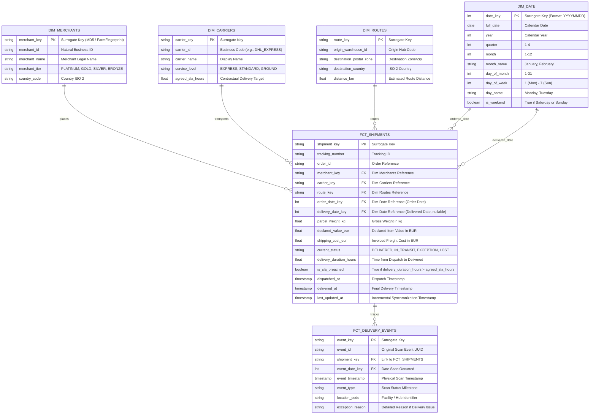

# CloudScale Data Dictionary & Schema Contracts

## 1. Overview & Data Architecture

This document defines the schema contracts, business logic, and dimensional models for the **LogiScale Express** logistics data platform.
The architecture implements a **Medallion Lakehouse** design pattern:
- **Bronze (Landing / Raw):** Ingestion of legacy OLTP PostgreSQL dumps, Warehouse Management System (WMS) batch CSVs, and carrier JSON webhook events.
- **Silver (Standardized / Cleaned):** Cleansed Snappy Parquet files processed via PySpark, applying explicit typing, deduplication, and Dead Letter Queue (DLQ) quarantining.
- **Gold (Core Dimensional Model):** Kimball Star Schema implemented in BigQuery using dbt.
- **Platinum (Analytics Marts):** Aggregated metrics and SLA performance views for BI tools (Looker Studio / Metabase).

---

## 2. Ingestion Source Contracts (Bronze Layer)

### 2.1 Source 1: PostgreSQL OLTP Database (`orders` & `merchants`)
Transactional orders generated by e-commerce merchants.

#### Table: `legacy_orders`
- **Source Type:** Relational Table / Batch SQL Extract
- **File Format:** CSV / Parquet
- **Target Raw Path:** `gs://cloudscale-raw/postgres_orders/dt={YYYY-MM-DD}/orders_{YYYYMMDD}.csv`

| Column Name | Data Type | Nullable | Description & Business Rules |
| :--- | :--- | :--- | :--- |
| `order_id` | `VARCHAR(64)` | NO | Unique e-commerce order ID (e.g. `ORD-2026-98124`). Primary natural key. |
| `merchant_id` | `VARCHAR(32)` | NO | Foreign key referencing merchant. Must exist in `legacy_merchants`. |
| `customer_postal_code` | `VARCHAR(20)` | NO | Destination postal code. |
| `customer_country` | `VARCHAR(2)` | NO | ISO 3166-1 alpha-2 destination country code (e.g., `FR`, `DE`, `ES`, `IT`, `NL`, `BE`). |
| `declared_value` | `NUMERIC(10,2)` | NO | Total declared package value. Must be `> 0`. |
| `currency` | `VARCHAR(3)` | NO | Currency of declared value (`EUR`, `USD`, `GBP`). Converted to EUR in Silver/Gold. |
| `order_timestamp` | `TIMESTAMP` | NO | UTC timestamp when order was placed. Cannot be in the future. |

#### Table: `legacy_merchants`
- **Source Type:** Relational Table / Batch SQL Extract
- **File Format:** CSV
- **Target Raw Path:** `gs://cloudscale-raw/postgres_merchants/merchants.csv`

| Column Name | Data Type | Nullable | Description & Business Rules |
| :--- | :--- | :--- | :--- |
| `merchant_id` | `VARCHAR(32)` | NO | Unique merchant identifier (e.g. `MERCH-0042`). Primary natural key. |
| `merchant_name` | `VARCHAR(128)` | NO | Registered company trade name. |
| `merchant_tier` | `VARCHAR(16)` | NO | Classification tier: `PLATINUM`, `GOLD`, `SILVER`, `BRONZE`. Dictates dispatch priority. |
| `country_code` | `VARCHAR(2)` | NO | Merchant registration country (ISO 2). |
| `created_at` | `TIMESTAMP` | NO | Merchant registration date. |

---

### 2.2 Source 2: Warehouse WMS Daily Export (`wms_dispatch_picks`)
Daily batch exports from regional fulfillment centers tracking warehouse pick & pack operations.

- **Source Type:** FTP Batch Drop
- **File Format:** Delimited CSV (pipe or comma separated)
- **Target Raw Path:** `gs://cloudscale-raw/wms_picks/dt={YYYY-MM-DD}/wms_dispatch_{YYYYMMDD}.csv`

| Column Name | Data Type | Nullable | Description & Business Rules |
| :--- | :--- | :--- | :--- |
| `wms_record_id` | `VARCHAR(64)` | NO | Internal warehouse operation ID. |
| `order_id` | `VARCHAR(64)` | NO | Foreign key to `legacy_orders.order_id`. |
| `warehouse_id` | `VARCHAR(32)` | NO | Fulfillment center identifier (`WH-PARIS-01`, `WH-BERLIN-02`, etc.). |
| `parcel_weight_kg` | `FLOAT` | NO | Measured scale weight in kilograms. **Must be > 0.01 kg**; values `<= 0` routed to DLQ. |
| `box_type` | `VARCHAR(16)` | YES | Packaging size indicator (`SMALL`, `MEDIUM`, `LARGE`, `PALLET`). |
| `picked_at` | `TIMESTAMP` | NO | UTC timestamp when items were collected from racks. |
| `packed_at` | `TIMESTAMP` | NO | UTC timestamp when parcel was boxed and sealed. Must be `>= picked_at`. |
| `dispatched_at`| `TIMESTAMP` | NO | UTC timestamp when carrier physically collected the package. Must be `>= packed_at`. |

---

### 2.3 Source 3: Carrier Webhook API Events (`carrier_pings`)
Real-time delivery milestone events pushed by mobile courier scanners and regional hubs.

- **Source Type:** Webhook JSON Event Stream
- **File Format:** Newline-Delimited JSON (NDJSON)
- **Target Raw Path:** `gs://cloudscale-raw/carrier_events/dt={YYYY-MM-DD}/events_{YYYYMMDD}.json`

| Column Name | Data Type | Nullable | Description & Business Rules |
| :--- | :--- | :--- | :--- |
| `event_id` | `VARCHAR(64)` | NO | Unique event UUID. Prone to duplicate webhook retries. |
| `tracking_number`| `VARCHAR(64)` | NO | Carrier parcel tracking number (e.g. `TRK-DHL-994182`). |
| `carrier_id` | `VARCHAR(32)` | NO | Carrier identifier (`DHL_EXPRESS`, `FEDEX_EU`, `CHRONOPOST`, `DPD_LOCAL`). |
| `event_type` | `VARCHAR(32)` | NO | Status enum: `ACCEPTED`, `IN_TRANSIT`, `OUT_FOR_DELIVERY`, `DELIVERED`, `FAILED_ATTEMPT`, `EXCEPTION`. |
| `scan_timestamp` | `TIMESTAMP` | NO | Event occurrence timestamp recorded by handheld terminal. |
| `received_at` | `TIMESTAMP` | NO | Timestamp webhook was received by CloudScale API. |
| `location_code` | `VARCHAR(32)` | YES | Hub or depot code where scan occurred (e.g. `HUB-CDG-A`). |
| `exception_reason` | `VARCHAR(128)` | YES | Failure detail if `event_type IN ('FAILED_ATTEMPT', 'EXCEPTION')` (e.g., `WRONG_ADDRESS`, `CONSIGNEE_ABSENT`, `DAMAGED_BOX`). |

---

## 3. Dimensional Core Warehouse Model (Gold Layer)

Modeled according to Ralph Kimball’s dimensional modeling methodology. Optimized for BigQuery analytics queries.

---

## 4. Analytics Marts (Platinum Layer)

High-performance denormalized tables or views feeding dashboards and management reports.

### 4.1 `mart_carrier_performance_daily`
- **Granularity:** 1 record per `date_key`, `carrier_key`, `route_key`.
- **Key Metrics:**
  - `total_shipments`: Count of parcels dispatched.
  - `delivered_shipments`: Count of successfully delivered parcels.
  - `sla_breached_shipments`: Count of parcels exceeding contracted SLA.
  - `otif_rate`: On-Time In-Full Rate (`(delivered_shipments - sla_breached_shipments) / delivered_shipments * 100.0`).
  - `avg_delivery_hours`: Average duration from warehouse dispatch to delivery door.

### 4.2 `mart_warehouse_fulfillment_efficiency`
- **Granularity:** 1 record per `warehouse_id`, `date_key`.
- **Key Metrics:**
  - `total_orders_received`: Total inbound order volume.
  - `median_pick_to_pack_minutes`: Processing latency inside the facility.
  - `median_pack_to_dispatch_minutes`: Staging and dock turnaround time.
  - `dispatch_backlog_count`: Orders pending dispatch past cutoff time.

### 4.3 `mart_shipping_profitability`
- **Granularity:** 1 record per `merchant_tier`, `destination_country`, `month`.
- **Key Metrics:**
  - `gross_revenue_eur`: Freight fees charged to merchants.
  - `carrier_costs_eur`: Direct courier invoices.
  - `net_margin_eur`: Net shipping margin (`gross_revenue - carrier_costs`).
  - `margin_percentage`: Profit margin ratio.

---

## 5. Data Quality Rules & Quarantine Thresholds (Tier 1 & Tier 2)

| Rule ID | Pipeline Tier | Target Attribute | Condition / Check | Action Upon Failure |
| :--- | :--- | :--- | :--- | :--- |
| `DQ-01` | PySpark (Tier 1) | `parcel_weight_kg` | `parcel_weight_kg > 0.01 AND parcel_weight_kg < 1000` | Route to DLQ (`ERR_INVALID_WEIGHT`) |
| `DQ-02` | PySpark (Tier 1) | `order_timestamp` | `order_timestamp <= CURRENT_TIMESTAMP()` | Route to DLQ (`ERR_FUTURE_TIMESTAMP`) |
| `DQ-03` | PySpark (Tier 1) | `order_id` / `event_id` | `IS NOT NULL AND LENGTH(TRIM(id)) > 0` | Route to DLQ (`ERR_NULL_KEY`) |
| `DQ-04` | PySpark (Tier 1) | `event_id` | Deduplicate via window over `event_id` ordering by `scan_timestamp DESC` | Discard duplicate scan |
| `DQ-05` | dbt (Tier 2) | Surrogate Keys | `unique`, `not_null` tests on `*_key` columns | Build failure / Alert |
| `DQ-06` | dbt (Tier 2) | Foreign Keys | Referential integrity test between Facts and Dimensions | Warning / Alert |
| `DQ-07` | dbt (Tier 2) | Date Sequence | `delivered_at >= dispatched_at >= order_timestamp` | Custom dbt test assertion failure |
